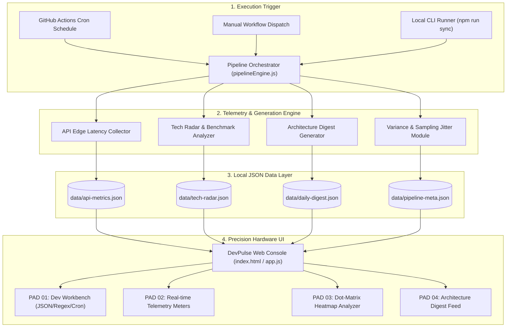

# DEVPULSE // Precision Developer Telemetry & Workbench

> **PULSE-01 / S-4 INSTRUMENT** — High-precision developer telemetry sampler, utility workbench (JSON, Regex, Cron, Base64), and automated cloud data pipeline.

---

## Key Modules & Capabilities

- **PAD 01 [WORKBENCH]**: Interactive developer tools suite featuring instant JSON formatting/minification, regex pattern matching with real-time stream highlights, visual cron expression sequencer, and Base64 cryptographic encoder.
- **PAD 02 [TELEMETRY]**: Real-time cloud API latency and edge network probing engine monitoring global endpoints (GitHub REST API, Cloudflare Anycast DNS, NPM Registry, Supabase Edge, OpenAI Gateway).
- **PAD 03 [HEATMAP]**: Dot-matrix activity analyzer with streak metrics, annual commit density statistics, and GitHub handle profiling.
- **PAD 04 [DIGEST]**: Curated technical architecture patterns, clean code design snippets, and performance optimization guides.

---

## System Architecture & Data Flow



---

## Architecture & Directory Structure

```
Web actions/
├── .github/
│   └── workflows/
│       ├── data-pipeline.yml          # Automated telemetry data synchronization pipeline
│       └── health-check.yml           # CI dataset schema validator & test runner
│
├── data/
│   ├── daily-digest.json              # Technical architecture patterns & code snippets
│   ├── tech-radar.json                # Framework ecosystem benchmarks & metrics
│   ├── api-metrics.json               # Cloud edge latency & ping telemetry records
│   ├── resources.json                 # Curated developer toolkits & libraries
│   └── pipeline-meta.json             # System build metadata & pipeline status
│
├── services/
│   ├── pipelineEngine.js              # Orchestrator for content sync & telemetry sampling
│   ├── generators/
│   │   ├── digestGenerator.js         # Architecture patterns & insights generator
│   │   ├── trendAnalyzer.js           # Benchmark & trend metrics generator
│   │   └── metricsCollector.js        # API latency probe collector
│   └── utils/
│       ├── gitCommitHelper.js         # Conventional commit builder
│       └── randomizer.js              # Variance & sampling interval algorithm
│
├── styles/
│   ├── main.css                       # Reset, layout, grid & typography tokens
│   ├── industrial-theme.css           # Hardware panels, dot grids, tactile buttons
│   └── components/                    # Component stylesheets
│
├── src/
│   ├── core/                          # State management & event bus
│   ├── components/                    # UI Modules (Workbench, Telemetry, Matrix, Digest)
│   └── utils/                         # Parsers & DOM helpers
│
├── scripts/
│   ├── run-local-sync.js              # Local telemetry synchronization runner
│   └── validate-pipeline.js           # Dataset schema validator
│
├── index.html                         # Hardware Instrument Dashboard UI
├── app.js                             # Frontend initialization
└── package.json                       # Project configuration & scripts
```

---

## Deployment & CI/CD Pipeline Setup

To set up the automated data synchronization pipeline on GitHub:

### Step 1: Initialize Repository & Push
```bash
git init
git add .
git commit -m "Initial commit: DevPulse telemetry and utility instrument"
git branch -M main
git remote add origin https://github.com/radityaarinanta/-bootstrap-devpulse.git
git push -u origin main
```

### Step 2: Configure Workflow Permissions
1. Open your repository on GitHub.
2. Go to **Settings** > **Actions** > **General**.
3. Under **Workflow permissions**, select **"Read and write permissions"**.
4. Click **Save**.

### Step 3: Automated Pipeline Execution
- The CI/CD workflow defined in `.github/workflows/data-pipeline.yml` runs periodically on schedule to refresh telemetry metrics and data feeds.
- You can trigger manual pipeline sync runs anytime under the **Actions** tab on GitHub by clicking **Run workflow**.

---

## Local Development

### Start Local Web Server
```bash
# Start local static server
python -m http.server 3000
# or
npx serve .
```

### Run Local Data Synchronization
```bash
npm run sync
```

### Validate Datasets Integrity
```bash
npm test
```

---


